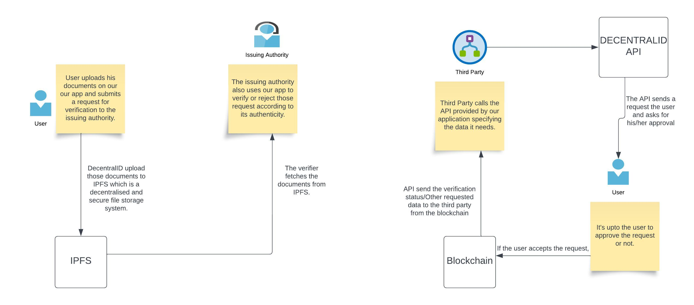
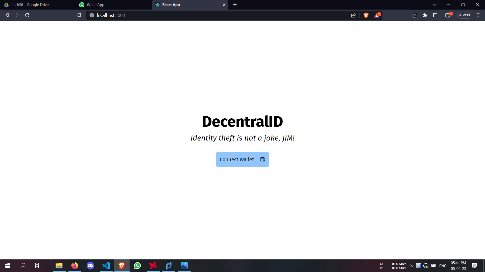
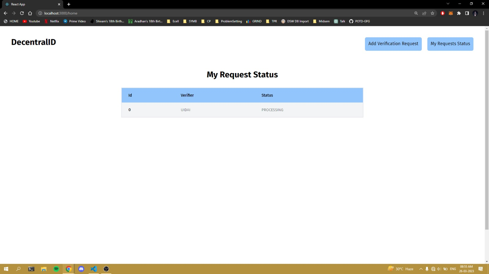
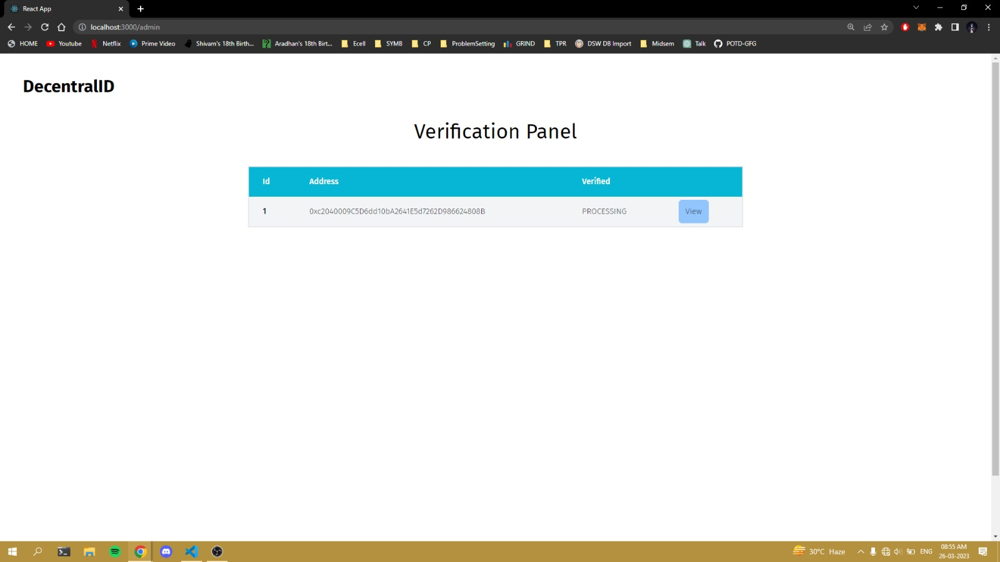
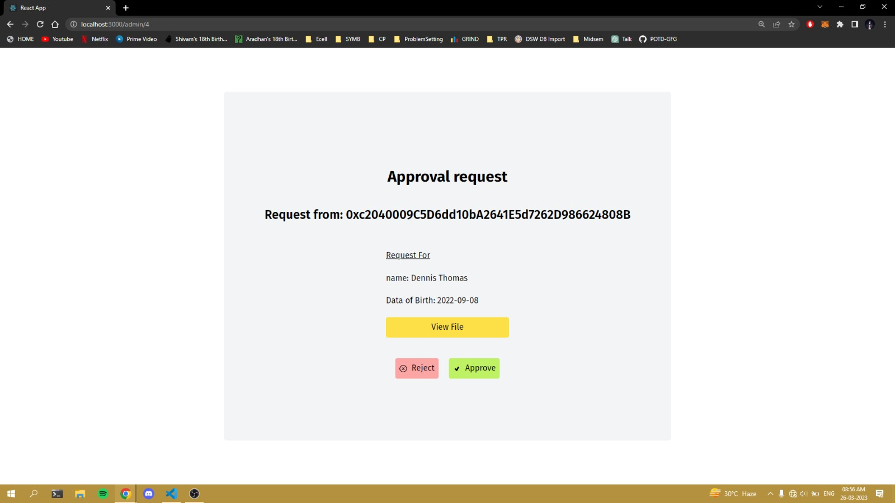
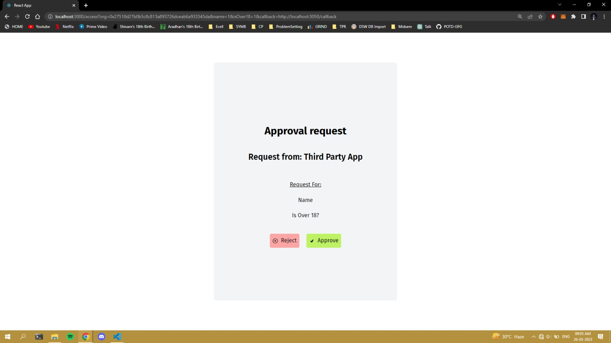

# DecentralID

**A decentralized identity verification platform built with Solidity, Ethereum, React, MetaMask, and IPFS that enables users to verify their identity without repeatedly sharing sensitive documents with third-party applications.**

[](https://soliditylang.org/)
[](https://react.dev/)
[](https://ethereum.org/)
[](https://ipfs.tech/)

**[Devfolio Project](https://devfolio.co/projects/decentralid-a6db) · [Presentation](https://docs.google.com/presentation/d/1fDOJagdUc-62sfzt8al91WkodRhC2Zv7d_QZ0y-s-NQ/edit?usp=sharing)**

---

## Overview

Traditional identity verification often requires users to upload government-issued documents directly to multiple third-party services.

This creates two major problems:

- Users reveal more personal information than may actually be necessary.
- Sensitive documents can become vulnerable when stored across centralized systems.

**DecentralID explores a decentralized approach to identity verification.**

Instead of every third-party application independently collecting and storing identity documents, DecentralID provides a verification layer where a user's document can be reviewed by an authorized verifier and the resulting verification state can be referenced through the blockchain.

The goal is to reduce unnecessary exposure of sensitive identity data while giving users greater control over the verification process.

---

## Key Features

- **Blockchain-based verification** using Ethereum smart contracts
- **MetaMask wallet integration** for account connection and transaction signing
- **Decentralized document storage** using IPFS
- **Verifier workflow** for reviewing identity documents
- **On-chain verification state** for transparent verification records
- **React-based frontend** for users and verifiers
- **Reusable verification model** that can be integrated with third-party applications
- **Reduced document sharing** compared with traditional verification workflows

---

## Architecture



The application combines a React frontend, Ethereum smart contracts, MetaMask, and IPFS.

```text
                    ┌─────────────────────┐
                    │        User         │
                    └──────────┬──────────┘
                               │
                               ▼
                    ┌─────────────────────┐
                    │   React Frontend    │
                    │   + Tailwind CSS    │
                    └───────┬───────┬─────┘
                            │       │
                    Document│       │Blockchain
                            │       │Transaction
                            ▼       ▼
                   ┌────────────┐  ┌─────────────────┐
                   │    IPFS    │  │    MetaMask     │
                   │  Storage   │  │ Ethereum Wallet │
                   └──────┬─────┘  └────────┬────────┘
                          │                 │
                          │                 ▼
                          │       ┌─────────────────────┐
                          │       │ Solidity Contracts  │
                          │       │      Ethereum       │
                          │       └──────────┬──────────┘
                          │                  │
                          ▼                  ▼
                    ┌────────────────────────────┐
                    │    Authorized Verifier     │
                    └─────────────┬──────────────┘
                                  │
                                  ▼
                    Verification status updated
                          on the blockchain
```

---

## How It Works

### 1. Connect Wallet

The user connects an Ethereum wallet through **MetaMask**.

### 2. Submit Identity Document

The user submits the required identity document through the DecentralID interface.

### 3. Store Document

The document is stored using **IPFS**, avoiding direct storage of the document itself on the blockchain.

### 4. Create Verification Request

A blockchain transaction records the verification request through the application's Solidity smart contracts.

### 5. Verify Identity

An authorized verifier reviews the submitted document and determines whether it is valid.

### 6. Update Verification Status

The verifier updates the user's verification state through the smart contract.

### 7. Reuse Verification

Third-party applications can use the resulting verification state rather than requiring the user to repeatedly upload the same identity document.

---

## Tech Stack

| Technology | Purpose |
|---|---|
| **Solidity** | Smart contract development and verification logic |
| **Ethereum** | Blockchain network for decentralized state and transactions |
| **Hardhat** | Smart contract development, testing, and deployment |
| **React.js** | Frontend application |
| **Tailwind CSS** | UI styling |
| **MetaMask** | Wallet connection and blockchain transaction signing |
| **IPFS** | Decentralized document storage |

---

## Technical Highlights

- Designed and implemented **Solidity smart contracts** for identity verification workflows.
- Used **Hardhat** to develop, test, and deploy Ethereum smart contracts.
- Integrated **MetaMask** with the frontend for wallet connection and blockchain transactions.
- Connected the React application with deployed smart contracts to read and update verification state.
- Integrated **IPFS** for decentralized document storage.
- Separated document storage from blockchain state to avoid storing large files directly on-chain.
- Designed a workflow involving users, verifiers, and third-party applications.
- Built the frontend using **React.js and Tailwind CSS**.
- Worked across both **Web2 and Web3 layers**, connecting frontend state, decentralized storage, wallets, and smart contracts.

---

## Why Not Store Documents On-Chain?

Storing identity documents directly on Ethereum would be expensive, inefficient, and inappropriate for sensitive files.

DecentralID instead separates the two responsibilities:

**IPFS**
- Stores document data in a decentralized file system.

**Ethereum**
- Stores application state and verification-related information through smart contracts.

This keeps large document files outside the blockchain while allowing blockchain-based logic to coordinate the verification process.

---

## Demo

### Architecture


### Application











---

## Engineering Challenges

### Smart Contract Design

One of the main challenges was determining how identity verification state should be represented and updated through smart contracts while keeping the application workflow simple.

This required thinking carefully about:

- State management
- Contract interactions
- Ethereum transactions
- Verifier actions
- User-to-contract interactions

### Learning Solidity

Solidity was new to me when I began the project.

I learned the language while building the application, including contract structure, state variables, mappings, functions, transactions, and deployment.

### Integrating IPFS

Adding decentralized file storage introduced another architectural layer.

I had to connect the frontend, IPFS document references, blockchain transactions, and the verification workflow into one application.

### Connecting Web2 and Web3

A major engineering challenge was connecting technologies with very different execution models:

```text
React UI
   ↓
MetaMask
   ↓
Ethereum Transaction
   ↓
Smart Contract
   ↓
Verification State

React UI
   ↓
IPFS
   ↓
Document Reference
```

Building these components together gave me practical experience designing and debugging a full-stack Web3 application.

---

## What I Learned

Building DecentralID gave me hands-on experience with:

- Solidity
- Ethereum smart contracts
- Hardhat
- Smart contract deployment
- MetaMask integration
- Blockchain transactions
- IPFS
- React.js
- Tailwind CSS
- Web3 frontend development
- Decentralized application architecture
- Smart contract state management
- Designing systems around privacy and identity verification

More importantly, the project helped me understand the tradeoffs involved in building applications where **blockchain, decentralized storage, and traditional frontend systems must work together**.

---

## Security Considerations

Decentralized storage alone does not automatically guarantee document privacy.

A production-ready version of DecentralID would require additional security mechanisms such as:

- Client-side document encryption
- Secure encryption-key management
- Fine-grained access control
- Verifier authentication and authorization
- Smart contract security audits
- Protection against unauthorized document retrieval
- Secure handling of IPFS content identifiers
- Careful management of personally identifiable information

These are important areas for extending the prototype into a production-grade identity system.

---

## Future Improvements

- Add end-to-end document encryption
- Implement stronger verifier authorization
- Support multiple independent verification authorities
- Add role-based access control
- Add comprehensive smart contract unit and integration tests
- Improve gas efficiency
- Support verification of individual identity attributes instead of entire documents
- Integrate decentralized identity standards such as DIDs and Verifiable Credentials
- Build an API/SDK for third-party applications
- Improve error handling and transaction feedback
- Improve the user and verifier dashboards
- Deploy the application to a public Ethereum test network
- Add production monitoring and security controls

---

## Project Resources

- **Devfolio:** [DecentralID Project](https://devfolio.co/projects/decentralid-a6db)
- **Presentation:** [Google Slides](https://docs.google.com/presentation/d/1fDOJagdUc-62sfzt8al91WkodRhC2Zv7d_QZ0y-s-NQ/edit?usp=sharing)

---

## About the Project

I built DecentralID as an exploration of how decentralized technologies can be applied to identity verification and privacy.

The project combines **smart contracts, decentralized storage, wallet authentication, and a modern frontend** into a single end-to-end application.

The core idea is simple:

> **Verify what is necessary without unnecessarily exposing the underlying identity document.**

---

## Disclaimer

DecentralID is a prototype built for educational and experimental purposes. It should not be used for production identity verification without additional security, privacy, compliance, and smart contract auditing measures.
